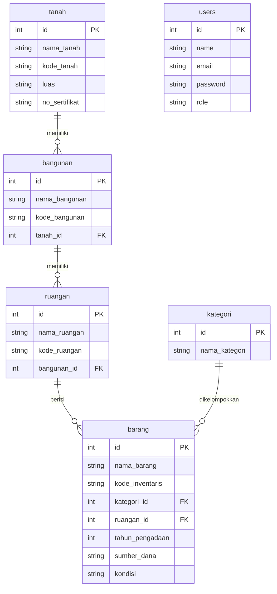

## Ringkasan
Proyek ini bertujuan untuk membangun sebuah aplikasi web yang berfungsi sebagai Sistem Informasi Manajemen Aset Sekolah (SIMASET). Aplikasi ini akan membantu sekolah dalam mendata dan mengelola seluruh asetnya secara terstruktur, mulai dari tanah, bangunan, ruangan, hingga barang-barang yang ada di dalamnya.
- Tujuan: Setelah menyelesaikan proyek ini, kamu diharapkan mampu:
- Merancang dan membuat database untuk aplikasi web.
- Menggunakan framework Laravel untuk membangun aplikasi web.
- Membuat fitur dasar aplikasi web (CRUD: Tambah, Baca, Ubah, Hapus data).
- Mengimplementasikan hubungan antar data (relasi) dalam database.
- Membangun aplikasi web yang siap digunakan.

## Fitur Utama Aplikasi

Aplikasi SIMASET Sekolah akan memiliki fitur-fitur berikut:
### 1. Manajemen Master Aset (Hierarkis)
- **Data Tanah:** Mencatat informasi tentang tanah yang dimiliki sekolah.
- **Data Bangunan:** Mencatat informasi bangunan, terhubung ke data Tanah.
- **Data Ruangan:** Mencatat informasi ruangan, terhubung ke data Bangunan.
- **Kategori Barang:** Mengelola jenis-jenis kategori untuk barang.

### 2. Manajemen Inventaris Barang
- Mencatat detail setiap barang, termasuk:
    - Kode Inventaris (otomatis)
    - Nama Barang
    - Kategori Barang
    - Lokasi (Ruangan tempat barang berada)
    - Tahun Pengadaan
    - Sumber Dana
    - Kondisi Barang (Baik, Rusak Ringan, Rusak Berat)

### 3. Pelaporan
- Mencetak daftar barang per ruangan.

### 4. Manajemen Pengguna
- Mengelola akun pengguna (Admin dan Petugas Inventaris).

## Teknologi yang Digunakan

- **Backend:** PHP & Laravel 12
- **Frontend:** HTML, CSS, JavaScript (dengan Bootstrap 5 atau Tailwind CSS)
- **Database:** MySQL / MariaDB

## Milestone
- [ ] **Milestone 1: Fondasi & CRUD Dasar (Minggu 1)**
    - Tujuan: Membangun dasar aplikasi dan menguasai operasi Tambah, Baca, Ubah, Hapus untuk satu jenis data.
- [ ] **Milestone 2: Relasi Data & Fitur Lanjutan (Minggu 2)**
    - Tujuan: Mengimplementasikan hubungan antar data dan menyelesaikan fitur utama aplikasi.

## Task
### Milestone 1 Tasks:
- [ ] Setup proyek Laravel dan konfigurasi database.
- [ ] Buat model dan migrasi untuk semua tabel (sesuai ERD).
- [ ] Implementasikan fitur Tambah, Baca, Ubah, Hapus (CRUD) untuk **Kategori Barang**.
- [ ] Terapkan validasi dasar pada form input.
- [ ] Berikan styling dasar pada tampilan aplikasi menggunakan Bootstrap.

### Milestone 2 Tasks:
- [ ] Implementasikan CRUD untuk **Tanah**.
- [ ] Implementasikan CRUD untuk **Bangunan**, dengan memilih data Tanah yang sesuai.
- [ ] Implementasikan CRUD untuk **Ruangan**, dengan memilih data Bangunan yang sesuai.
- [ ] Implementasikan CRUD untuk **Barang**, dengan memilih data Ruangan dan Kategori yang sesuai.
- [ ] Tampilkan data relasional (misal: daftar bangunan di halaman detail tanah).
- [ ] Buat fitur pelaporan (cetak daftar barang per ruangan).
- [ ] Terapkan sistem login dan pembatasan akses pengguna (Admin dan Petugas).

## Diagram Arsitektur Database (ERD)

Berikut adalah gambaran struktur database untuk proyek ini. Pahami hubungan antar tabel untuk membangun aplikasi yang benar.



## Link Terkait
- Modul Ajar: [[Rancangan Projek Manajemen Barang atau Aset Untuk Kelas 12 RPL]]
- Daily logs:
```dataview
TASK FROM "01_Daily" WHERE contains(file.tasks.text, this.file.name)
```
